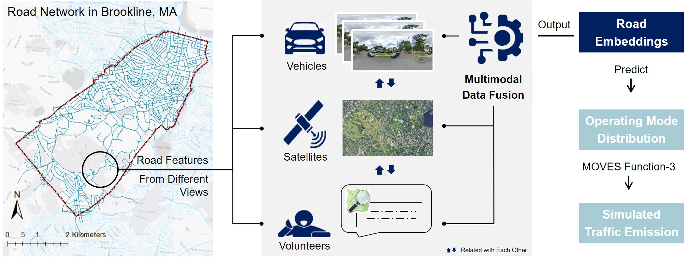
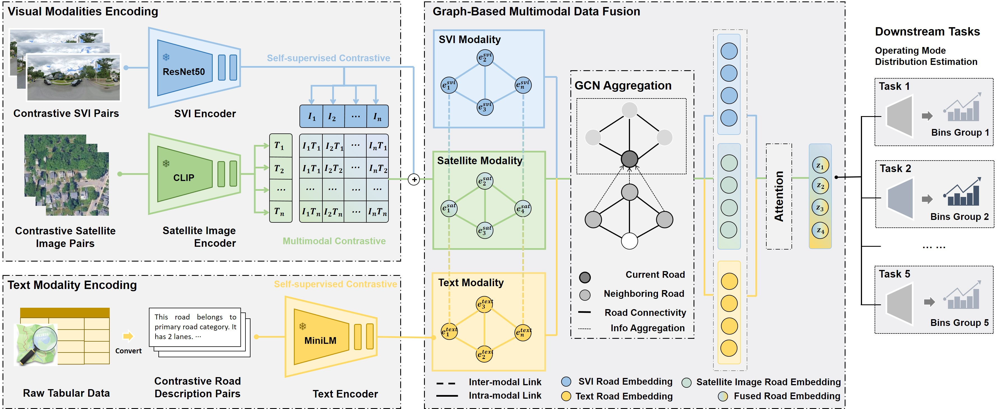

# Contrastive Multi-Modal Graph Representation Learning for Road-level Operating Mode Distribution Prediction using Open Source Data.

## Intuition
Different modalities of data provides complementary information for understanding road characteristics.

## Modalities and Data Source
- Street view Images (SVIs): Google Map Platform
- Satellite Images: Mapbox
- Tabular data: Open Street Map(OSM)

## Model Architecture

